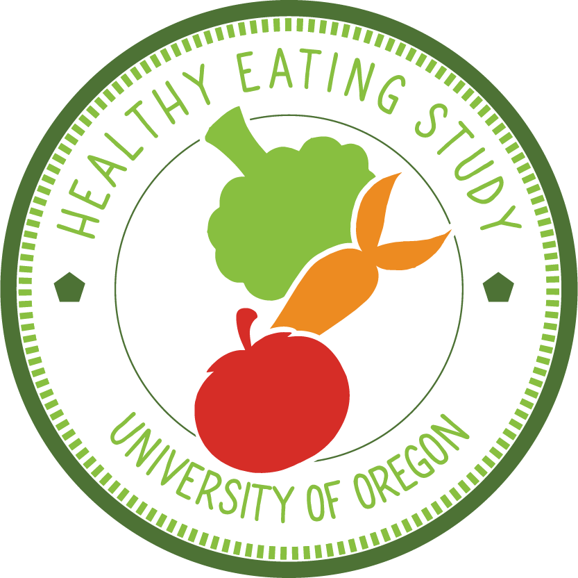

 

This project is a large-scale randomized-control trial that investigates the efficacy and mechanisms of a healthy eating invention. Specifically, the RCT compares a cognitive reappraisal training, in which participants change the way they think about unhealthy food, to a behavioral response training, in which participants modify their physical motor responses to food stimuli to train neural inhibitory control circuits. I helped co-design the cognitive reappraisal intervention, and created an automated workflow for daily backup of fMRI data via a high performance computing cluster.