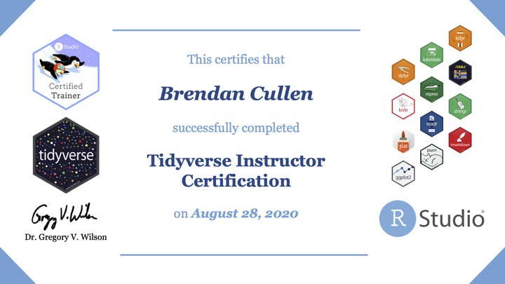

I recently went through RStudio's [Instructor Training and Certification Program](https://education.rstudio.com/trainers/), and I am now an RStudio Certified Instructor in the [tidyverse](https://www.tidyverse.org/). You can read more details in the links above. 

If you'd like to hire me to lead a workshop or training for your group, please don't hesitate to [reach out](mailto:bcullen@uoregon.edu). I would love to hear from you!
